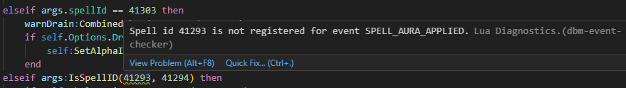
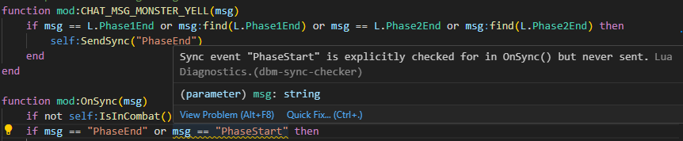

# LuaLS setup for Deadly Boss Mods

A LuaLS plugin for DBM development, features:

* Dynamic and automatically derived definitions for DBM mods
* Custom diagnostics that find common mistakes in event handlers
* A few extra definitions beyond what [vscode-wow-api](https://github.com/Ketho/vscode-wow-api), mostly for Classic

## Features

**Event registration check**

Checks if events for the handlers you define are registered, including checking for spell IDs referenced in the handler.



**Sync handler check**

Finds mismatches between sync messages sent and received.



**Auto-complete for events**

Includes support for combat log sub-events and DBM-specific events like `_UNFILTERED` unit events.


**Finds typos and other mistakes that are hard to spot**


**Can't remember all the NewTimer and NewAnnounce things? We got autocomplete for all of these!**


**NewTimer takes 17 parameters, do you know which is which at a glance?**


(`Cmd+Shift+Space` in VS Code)

## Setup for development

1. Install [Visual Studio Code](https://code.visualstudio.com/)
2. Install the [lua-language-server extension](https://marketplace.visualstudio.com/items?itemName=sumneko.lua) for VS Code (Note: currently needs a patched version, see first FAQ entry below)
3. Install the [WoW API extension](https://marketplace.visualstudio.com/items?itemName=ketho.wow-api) for VS Code
4. Clone this repo: `git clone git@github.com:DeadlyBossMods/LuaLS-Config`
5. Open VS Code's settings.json (`Cmd+Shift+P` -> "Open User Settings (JSON)")
6. Enable the DBM plugin for LuaLS to settings.json
	1. Add this line: `"Lua.runtime.plugin": "<path to where you cloned LuaLS-Config>/Plugin/Plugin.lua",`
7. Add extra definitions for DBM to settings.json
	1. Find the `Lua.workspace.library` entry, it should already exist and have entries from the WoW API extension
	2. Add this line to the library array: `<path to where you cloned LuaLS-Config>/Definitions`
	3. Add this line to the library array: `<path to where you cloned the DBM-Unified repo>`

Your settings.json should look like this afterwards:

```
	"Lua.workspace.library": [
		"C:/Users/You/wow-addons/DBM-Unified",
		"C:/Users/You/wow-addons/LuaLS-Config/Definitions",
		"c:\\Users\\You\\.vscode\\extensions\\ketho.wow-api-0.13.2\\EmmyLua\\API",
		"c:\\Users\\You\\.vscode\\extensions\\ketho.wow-api-0.13.2\\EmmyLua\\Optional"
	],
	"Lua.runtime.plugin": "C:/Users/You/wow-addons/LuaLS-Config/Plugin/Plugin.lua",
```

## Setup for CI checks

TODO: haven't done this yet, but it pretty much just needs a config file pointing to the right places as library and done.

## FAQ

### Why is this so annoying to install and needs changes to my settings.json?

Because git submodules are terrible, so we need add workspace-external references for the library path and plugin.
Another solution would be one huge monorepo for all of DBM, but that would require a significant amount of work for the release infrastructure.

### I get lots of errors about injected fields on DBM mods, the spell ID check doesn't work and event handlers don't know their parameter types.

Check if the plugin is being loaded correctly, it will output "Loaded DBM-Plugin" to the LuaLS log (Output -> Lua in VS Code) on startup.

Make sure that your LuaLS installation is new enough to contain [LuaLS/lua-language-server#2502](https://github.com/LuaLS/lua-language-server/pull/2502).

As of today (version 3.7.4) that means you will need to run LuaLS from HEAD.
A hacky quick way to install a patched version is to just take the whole `script/` folder from my branch and copy it into the VS Code extension at `$HOME/.vscode/extensions/sumneko.lua-XYZ/server/script`.

### Why do we need a plugin?

Two reasons: (1) the event registration, spell ID, and sync checks are implemented as a custom diagnostic in the plugin.

And (2): Because the type system cannot express the concept of abstract base classes properly.
DBM defines boss mod base functions in `bossModPrototype` in DBM-Core, this is the class `DBMMod`.
A boss mod implementation effectively inherits from this when calling `DBM:NewMod()` and this concrete class implements things like event handlers etc.
One important feature that we are looking for is automatic inference of the types of these event handlers, i.e., a combat log event should know that it receives an args table without requiring an explicit annotation.

The type system gets us about 90% there, but it can't quite fully express this.
See [LuaLS/lua-language-server#2453](https://github.com/LuaLS/lua-language-server/issues/2453) for an example of what we can't fully express.

Also, the plugin allows us to correctly handle mods with zero additional boilerplate, it just works!
